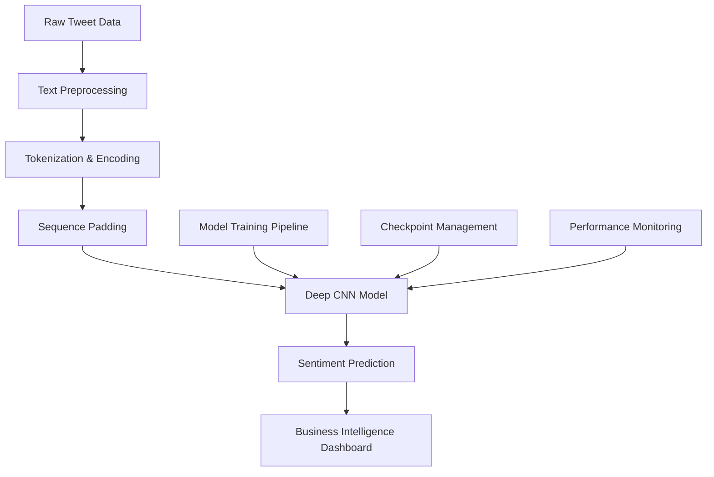

# 🔧 Technical Documentation: Deep CNN Sentiment Analysis | Documentación Técnica: Análisis de Sentimientos CNN Profunda

## 🏗️ System Architecture | Arquitectura del Sistema

### Overview | Resumen General

**English**: This document provides comprehensive technical documentation for the Deep Convolutional Neural Network (DCNN) sentiment analysis system. The architecture is designed for production deployment with emphasis on scalability, maintainability, and performance.

**Español**: Este documento proporciona documentación técnica integral para el sistema de análisis de sentimientos de Red Neuronal Convolucional Profunda (DCNN). La arquitectura está diseñada para despliegue en producción con énfasis en escalabilidad, mantenibilidad y rendimiento.

### High-Level Architecture | Arquitectura de Alto Nivel



## 🧮 Model Architecture Details | Detalles de la Arquitectura del Modelo

### Network Design | Diseño de la Red

```python
# Model Architecture Summary
Input: Padded sequences (batch_size, max_length)
  ↓
Embedding Layer: (vocab_size=65536, embedding_dim=200)
  ↓
Parallel Convolution Branches:
├── Conv1D(filters=100, kernel_size=2) → GlobalMaxPool1D
├── Conv1D(filters=100, kernel_size=3) → GlobalMaxPool1D  
└── Conv1D(filters=100, kernel_size=4) → GlobalMaxPool1D
  ↓
Concatenate: (batch_size, 300)
  ↓
Dense(256, activation='relu')
  ↓
Dropout(0.2)
  ↓
Dense(1, activation='sigmoid')
  ↓
Output: Sentiment probability [0,1]
```

### Mathematical Formulation | Formulación Matemática

**Embedding Layer**:
```
E(x) = W_e[x] ∈ ℝ^d
where W_e ∈ ℝ^{|V| × d}, |V| = vocabulary size, d = embedding dimension
```

**Convolution Operation**:
```
C_k(x) = ReLU(W_k * x + b_k)
where k ∈ {2,3,4} represents kernel size
```

**Global Max Pooling**:
```
P_k = max(C_k(x))
```

**Final Classification**:
```
ŷ = σ(W_out[P_2; P_3; P_4] + b_out)
where σ is sigmoid activation, [;] is concatenation
```

## 📊 Data Pipeline | Pipeline de Datos

### Preprocessing Pipeline | Pipeline de Preprocesamiento

```python
def preprocessing_pipeline(raw_text):
    """
    Comprehensive text preprocessing pipeline
    
    Args:
        raw_text (str): Raw tweet text
        
    Returns:
        str: Cleaned and normalized text
    """
    # Step 1: HTML parsing and entity removal
    text = BeautifulSoup(raw_text, "lxml").get_text()
    
    # Step 2: Remove user mentions (@username)
    text = re.sub(r"@[A-Za-z0-9]+", ' ', text)
    
    # Step 3: Remove URLs
    text = re.sub(r"http?://[A-Za-z0-9./]+", ' ', text)
    
    # Step 4: Keep only letters and basic punctuation
    text = re.sub(r"[^a-zA-Z.!?']+", ' ', text)
    
    # Step 5: Normalize whitespace
    text = re.sub(r" +", ' ', text)
    
    return text.strip()
```

### Tokenization Strategy | Estrategia de Tokenización

**Subword Tokenization Benefits**:
- **Out-of-Vocabulary Handling**: Manages unknown words through subword units
- **Morphological Awareness**: Captures word stems and affixes
- **Vocabulary Efficiency**: 65K subwords vs. potentially millions of words
- **Social Media Optimization**: Handles hashtags, slang, and emerging language

```python
# Tokenizer Configuration
tokenizer = tfds.deprecated.text.SubwordTextEncoder.build_from_corpus(
    corpus=cleaned_tweets,
    target_vocab_size=2**16,  # 65,536 tokens
    max_subword_length=10,
    reserved_tokens=['<pad>', '<unk>']
)
```

## ⚡ Performance Optimization | Optimización del Rendimiento

### Training Optimizations | Optimizaciones de Entrenamiento

```python
# Optimized Training Configuration
training_config = {
    'batch_size': 32,           # Memory-efficient batch size
    'epochs': 5,                # Prevents overfitting on large dataset
    'learning_rate': 0.001,     # Adam optimizer default
    'dropout_rate': 0.2,        # Regularization
    'early_stopping': True,     # Monitor validation loss
    'checkpoint_frequency': 1   # Save after each epoch
}

# Memory Optimization
data_generator = tf.data.Dataset.from_tensor_slices((train_inputs, train_labels))
data_generator = data_generator.batch(32).prefetch(tf.data.AUTOTUNE)
```

### Inference Optimizations | Optimizaciones de Inferencia

```python
# Production Inference Pipeline
@tf.function
def predict_sentiment(text_batch):
    """
    Optimized inference function with graph compilation
    
    Args:
        text_batch: Preprocessed and tokenized text batch
        
    Returns:
        Sentiment predictions with confidence scores
    """
    predictions = model(text_batch, training=False)
    confidence = tf.abs(predictions - 0.5) * 2  # Confidence metric
    sentiment = tf.cast(predictions > 0.5, tf.int32)
    
    return {
        'sentiment': sentiment,
        'confidence': confidence,
        'probability': predictions
    }
```

## 🛠️ Production Deployment | Despliegue en Producción

### Docker Configuration | Configuración de Docker

```dockerfile
# Production Dockerfile
FROM tensorflow/tensorflow:2.10.0-gpu

WORKDIR /app

# Install system dependencies
RUN apt-get update && apt-get install -y \
    python3-pip \
    python3-dev \
    && rm -rf /var/lib/apt/lists/*

# Install Python dependencies
COPY requirements.txt .
RUN pip install --no-cache-dir -r requirements.txt

# Copy application code
COPY . .

# Expose port for API
EXPOSE 8080

# Health check
HEALTHCHECK --interval=30s --timeout=30s --start-period=60s --retries=3 \
    CMD curl -f http://localhost:8080/health || exit 1

# Run application
CMD ["python", "sentiment_api.py"]
```

### API Specification | Especificación de API

```python
# FastAPI Implementation
from fastapi import FastAPI, HTTPException
from pydantic import BaseModel
from typing import List, Optional

app = FastAPI(title="Sentiment Analysis API", version="1.0.0")

class SentimentRequest(BaseModel):
    texts: List[str]
    include_confidence: Optional[bool] = True
    batch_size: Optional[int] = 32

class SentimentResponse(BaseModel):
    predictions: List[dict]
    processing_time: float
    model_version: str

@app.post("/predict", response_model=SentimentResponse)
async def predict_sentiment(request: SentimentRequest):
    """
    Predict sentiment for batch of texts
    
    Returns:
        - sentiment: 0 (negative) or 1 (positive)
        - confidence: 0.0 to 1.0
        - probability: raw model output
    """
    try:
        start_time = time.time()
        
        # Preprocess texts
        cleaned_texts = [preprocess_text(text) for text in request.texts]
        
        # Tokenize and pad
        tokenized = [tokenizer.encode(text) for text in cleaned_texts]
        padded = tf.keras.preprocessing.sequence.pad_sequences(
            tokenized, maxlen=MAX_LEN, padding='post'
        )
        
        # Predict
        predictions = model.predict(padded, batch_size=request.batch_size)
        
        # Format response
        results = []
        for i, pred in enumerate(predictions):
            result = {
                'text_index': i,
                'sentiment': 'positive' if pred[0] > 0.5 else 'negative',
                'probability': float(pred[0])
            }
            
            if request.include_confidence:
                result['confidence'] = abs(pred[0] - 0.5) * 2
                
            results.append(result)
        
        processing_time = time.time() - start_time
        
        return SentimentResponse(
            predictions=results,
            processing_time=processing_time,
            model_version="1.0.0"
        )
        
    except Exception as e:
        raise HTTPException(status_code=500, detail=str(e))
```

## 📈 Monitoring & Observability | Monitoreo y Observabilidad

### Model Performance Monitoring | Monitoreo del Rendimiento del Modelo

```python
# Performance Monitoring Pipeline
class ModelMonitor:
    def __init__(self, model, metrics_collector):
        self.model = model
        self.metrics = metrics_collector
        
    def log_prediction(self, input_text, prediction, confidence, response_time):
        """Log prediction metrics for monitoring"""
        self.metrics.log({
            'timestamp': datetime.utcnow(),
            'input_length': len(input_text),
            'prediction': prediction,
            'confidence': confidence,
            'response_time_ms': response_time * 1000,
            'model_version': self.model.version
        })
    
    def detect_drift(self, recent_predictions, baseline_accuracy=0.85):
        """Detect model performance drift"""
        if len(recent_predictions) < 100:
            return False
            
        recent_accuracy = np.mean(recent_predictions)
        drift_threshold = baseline_accuracy * 0.95  # 5% degradation
        
        return recent_accuracy < drift_threshold
    
    def generate_alert(self, alert_type, details):
        """Generate monitoring alerts"""
        alert = {
            'type': alert_type,
            'timestamp': datetime.utcnow(),
            'details': details,
            'severity': 'high' if alert_type == 'drift' else 'medium'
        }
        
        # Send to monitoring system (Prometheus, DataDog, etc.)
        self.send_alert(alert)
```

### Health Check Endpoints | Endpoints de Verificación de Salud

```python
@app.get("/health")
async def health_check():
    """System health check"""
    try:
        # Check model availability
        test_input = np.zeros((1, MAX_LEN))
        _ = model.predict(test_input)
        
        # Check tokenizer
        _ = tokenizer.encode("test")
        
        return {
            "status": "healthy",
            "model_loaded": True,
            "tokenizer_loaded": True,
            "timestamp": datetime.utcnow().isoformat()
        }
    except Exception as e:
        return {
            "status": "unhealthy",
            "error": str(e),
            "timestamp": datetime.utcnow().isoformat()
        }

@app.get("/metrics")
async def get_metrics():
    """Prometheus-compatible metrics endpoint"""
    return {
        "predictions_total": metrics_counter.value,
        "avg_response_time": metrics_timer.average,
        "error_rate": error_counter.value / predictions_total,
        "model_accuracy": current_accuracy.value
    }
```

## 🔒 Security & Privacy | Seguridad y Privacidad

### Data Protection | Protección de Datos

```python
# Data Privacy Implementation
class PrivacyManager:
    def __init__(self):
        self.pii_patterns = [
            r'\b\d{3}-\d{2}-\d{4}\b',  # SSN
            r'\b\d{4}\s?\d{4}\s?\d{4}\s?\d{4}\b',  # Credit card
            r'\b[A-Za-z0-9._%+-]+@[A-Za-z0-9.-]+\.[A-Z|a-z]{2,}\b'  # Email
        ]
    
    def anonymize_text(self, text):
        """Remove PII from text before processing"""
        anonymized = text
        for pattern in self.pii_patterns:
            anonymized = re.sub(pattern, '[REDACTED]', anonymized)
        return anonymized
    
    def audit_log(self, user_id, action, data_processed):
        """Log data processing for compliance"""
        log_entry = {
            'user_id': user_id,
            'action': action,
            'timestamp': datetime.utcnow(),
            'data_size': len(data_processed),
            'ip_address': request.remote_addr
        }
        self.compliance_logger.log(log_entry)
```

### Input Validation & Sanitization | Validación y Saneamiento de Entrada

```python
class InputValidator:
    MAX_TEXT_LENGTH = 1000
    MIN_TEXT_LENGTH = 5
    
    def validate_input(self, text):
        """Validate and sanitize input text"""
        if not isinstance(text, str):
            raise ValueError("Input must be string")
            
        if len(text) < self.MIN_TEXT_LENGTH:
            raise ValueError(f"Text too short (min {self.MIN_TEXT_LENGTH} chars)")
            
        if len(text) > self.MAX_TEXT_LENGTH:
            raise ValueError(f"Text too long (max {self.MAX_TEXT_LENGTH} chars)")
            
        # Remove potentially malicious content
        sanitized = self.sanitize_text(text)
        return sanitized
    
    def sanitize_text(self, text):
        """Remove potentially harmful content"""
        # Remove script tags and other potentially malicious content
        sanitized = re.sub(r'<script.*?</script>', '', text, flags=re.IGNORECASE)
        sanitized = re.sub(r'javascript:', '', sanitized, flags=re.IGNORECASE)
        return sanitized
```

## 🧪 Testing Framework | Marco de Pruebas

### Unit Tests | Pruebas Unitarias

```python
import pytest
import numpy as np
from unittest.mock import Mock, patch

class TestSentimentModel:
    def setup_method(self):
        """Setup test fixtures"""
        self.model = load_test_model()
        self.tokenizer = load_test_tokenizer()
        self.test_texts = [
            "I love this product!",
            "This is terrible quality",
            "Neutral opinion about service"
        ]
    
    def test_preprocessing_pipeline(self):
        """Test text preprocessing"""
        dirty_text = "Check out http://example.com @user #hashtag! <script>alert('xss')</script>"
        clean_text = preprocess_text(dirty_text)
        
        assert "http://" not in clean_text
        assert "@user" not in clean_text
        assert "<script>" not in clean_text
        assert len(clean_text) > 0
    
    def test_model_prediction_shape(self):
        """Test model output shape"""
        batch_size = 5
        test_input = np.random.randint(0, 1000, (batch_size, MAX_LEN))
        predictions = self.model.predict(test_input)
        
        assert predictions.shape == (batch_size, 1)
        assert np.all(predictions >= 0) and np.all(predictions <= 1)
    
    def test_tokenization_consistency(self):
        """Test tokenizer consistency"""
        text = "This is a test message"
        tokens1 = self.tokenizer.encode(text)
        tokens2 = self.tokenizer.encode(text)
        
        assert tokens1 == tokens2
        assert len(tokens1) > 0
    
    @pytest.mark.parametrize("text,expected_sentiment", [
        ("I love this!", "positive"),
        ("This is awful!", "negative"),
        ("Amazing product quality!", "positive")
    ])
    def test_sentiment_accuracy(self, text, expected_sentiment):
        """Test sentiment prediction accuracy"""
        prediction = predict_sentiment_single(text)
        predicted_sentiment = "positive" if prediction > 0.5 else "negative"
        assert predicted_sentiment == expected_sentiment
```

### Integration Tests | Pruebas de Integración

```python
class TestAPIIntegration:
    def setup_method(self):
        """Setup API test client"""
        self.client = TestClient(app)
    
    def test_health_endpoint(self):
        """Test health check endpoint"""
        response = self.client.get("/health")
        assert response.status_code == 200
        assert response.json()["status"] == "healthy"
    
    def test_prediction_endpoint(self):
        """Test prediction endpoint"""
        payload = {
            "texts": ["I love this product!", "This is terrible"],
            "include_confidence": True
        }
        
        response = self.client.post("/predict", json=payload)
        assert response.status_code == 200
        
        data = response.json()
        assert len(data["predictions"]) == 2
        assert "confidence" in data["predictions"][0]
        assert "processing_time" in data
    
    def test_batch_processing(self):
        """Test batch processing performance"""
        large_batch = ["Test message"] * 100
        payload = {"texts": large_batch}
        
        start_time = time.time()
        response = self.client.post("/predict", json=payload)
        processing_time = time.time() - start_time
        
        assert response.status_code == 200
        assert processing_time < 10.0  # Should process 100 texts in <10s
```

### Performance Tests | Pruebas de Rendimiento

```python
class TestPerformance:
    def test_inference_speed(self):
        """Test single prediction speed"""
        text = "This is a test message for performance testing"
        
        times = []
        for _ in range(100):
            start = time.time()
            _ = predict_sentiment_single(text)
            times.append(time.time() - start)
        
        avg_time = np.mean(times)
        assert avg_time < 0.05  # <50ms average
    
    def test_batch_efficiency(self):
        """Test batch processing efficiency"""
        batch_sizes = [1, 10, 32, 100]
        
        for batch_size in batch_sizes:
            texts = ["Test message"] * batch_size
            
            start = time.time()
            predictions = predict_sentiment_batch(texts)
            total_time = time.time() - start
            
            per_sample_time = total_time / batch_size
            
            # Batch processing should be more efficient
            if batch_size > 1:
                assert per_sample_time < 0.02  # <20ms per sample in batch
```

## 📚 API Documentation | Documentación de API

### OpenAPI Specification | Especificación OpenAPI

```yaml
openapi: 3.0.0
info:
  title: Sentiment Analysis API
  version: 1.0.0
  description: Production-ready sentiment analysis for social media text
  
servers:
  - url: https://api.sentiment.company.com/v1
    description: Production server
  - url: https://staging-api.sentiment.company.com/v1
    description: Staging server

paths:
  /predict:
    post:
      summary: Predict sentiment for text batch
      requestBody:
        required: true
        content:
          application/json:
            schema:
              type: object
              properties:
                texts:
                  type: array
                  items:
                    type: string
                  maxItems: 100
                include_confidence:
                  type: boolean
                  default: true
                batch_size:
                  type: integer
                  minimum: 1
                  maximum: 100
                  default: 32
      responses:
        200:
          description: Successful prediction
          content:
            application/json:
              schema:
                type: object
                properties:
                  predictions:
                    type: array
                    items:
                      type: object
                      properties:
                        text_index:
                          type: integer
                        sentiment:
                          type: string
                          enum: [positive, negative]
                        probability:
                          type: number
                          minimum: 0
                          maximum: 1
                        confidence:
                          type: number
                          minimum: 0
                          maximum: 1
                  processing_time:
                    type: number
                  model_version:
                    type: string
        400:
          description: Invalid input
        500:
          description: Server error
```

## 🔄 CI/CD Pipeline | Pipeline de CI/CD

### GitHub Actions Workflow | Flujo de Trabajo de GitHub Actions

```yaml
name: Sentiment Analysis CI/CD

on:
  push:
    branches: [main, develop]
  pull_request:
    branches: [main]

jobs:
  test:
    runs-on: ubuntu-latest
    
    steps:
    - uses: actions/checkout@v3
    
    - name: Set up Python
      uses: actions/setup-python@v3
      with:
        python-version: '3.9'
    
    - name: Install dependencies
      run: |
        pip install -r requirements.txt
        pip install -r requirements-dev.txt
    
    - name: Run tests
      run: |
        pytest tests/ --cov=src --cov-report=xml
    
    - name: Upload coverage
      uses: codecov/codecov-action@v3
    
    - name: Run security scan
      run: |
        bandit -r src/
        safety check
    
    - name: Lint code
      run: |
        flake8 src/
        black --check src/
    
  build:
    needs: test
    runs-on: ubuntu-latest
    
    steps:
    - uses: actions/checkout@v3
    
    - name: Build Docker image
      run: |
        docker build -t sentiment-analysis:${{ github.sha }} .
    
    - name: Run container tests
      run: |
        docker run --rm sentiment-analysis:${{ github.sha }} python -m pytest
    
    - name: Push to registry
      if: github.ref == 'refs/heads/main'
      run: |
        echo ${{ secrets.DOCKER_TOKEN }} | docker login -u ${{ secrets.DOCKER_USERNAME }} --password-stdin
        docker push sentiment-analysis:${{ github.sha }}
```

---

## 📋 Configuration Management | Gestión de Configuración

### Environment Configuration | Configuración de Entorno

```python
# config.py
import os
from typing import Optional

class Config:
    # Model settings
    VOCAB_SIZE: int = 65536
    MAX_SEQUENCE_LENGTH: int = 280
    EMBEDDING_DIM: int = 200
    NUM_FILTERS: int = 100
    DENSE_UNITS: int = 256
    DROPOUT_RATE: float = 0.2
    
    # Training settings
    BATCH_SIZE: int = int(os.getenv('BATCH_SIZE', '32'))
    LEARNING_RATE: float = float(os.getenv('LEARNING_RATE', '0.001'))
    EPOCHS: int = int(os.getenv('EPOCHS', '5'))
    
    # API settings
    API_HOST: str = os.getenv('API_HOST', '0.0.0.0')
    API_PORT: int = int(os.getenv('API_PORT', '8080'))
    API_WORKERS: int = int(os.getenv('API_WORKERS', '4'))
    
    # Data paths
    DATA_BASE_PATH: str = os.getenv('SENTIMENT_BASE', os.getcwd())
    MODEL_PATH: str = os.path.join(DATA_BASE_PATH, 'CheckPoint')
    
    # Security
    API_KEY_REQUIRED: bool = os.getenv('API_KEY_REQUIRED', 'false').lower() == 'true'
    RATE_LIMIT_REQUESTS: int = int(os.getenv('RATE_LIMIT_REQUESTS', '1000'))
    RATE_LIMIT_WINDOW: int = int(os.getenv('RATE_LIMIT_WINDOW', '3600'))
    
    # Logging
    LOG_LEVEL: str = os.getenv('LOG_LEVEL', 'INFO')
    LOG_FORMAT: str = '%(asctime)s - %(name)s - %(levelname)s - %(message)s'
    
    # Monitoring
    METRICS_ENABLED: bool = os.getenv('METRICS_ENABLED', 'true').lower() == 'true'
    PROMETHEUS_PORT: int = int(os.getenv('PROMETHEUS_PORT', '9090'))
```

---

**Document Version**: 1.0.0  
**Last Updated**: October 2025  
**Maintainers**: ML Engineering Team  
**Next Review**: January 2026