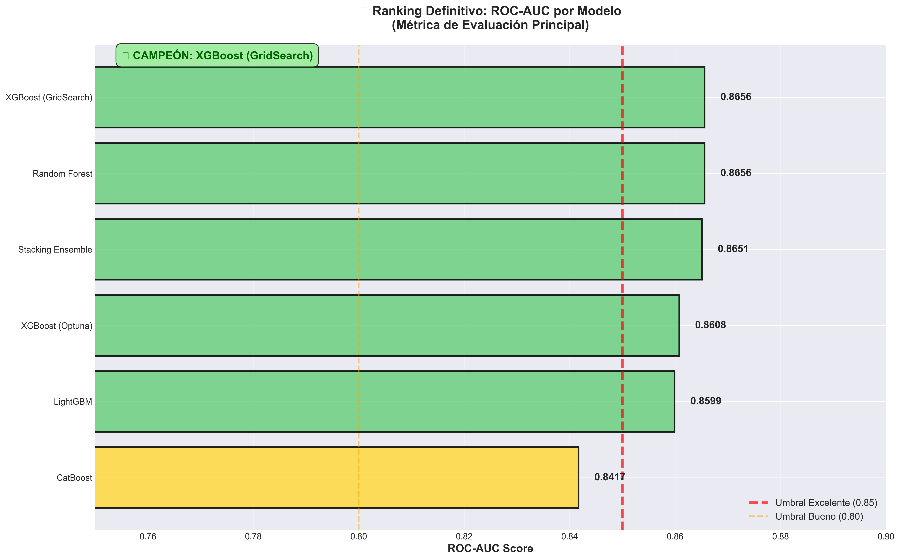
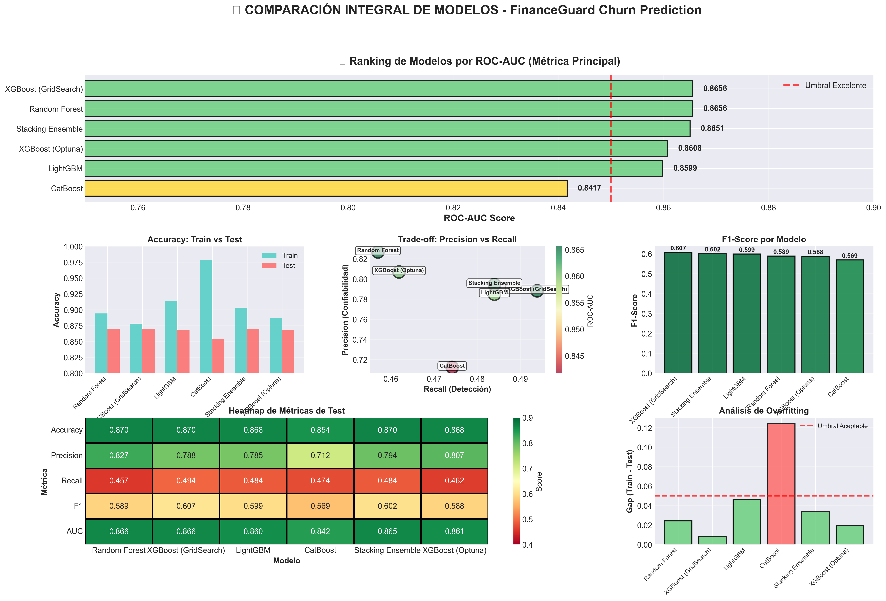
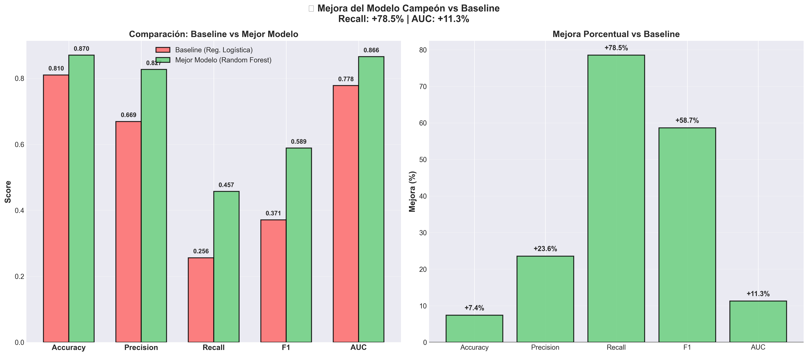
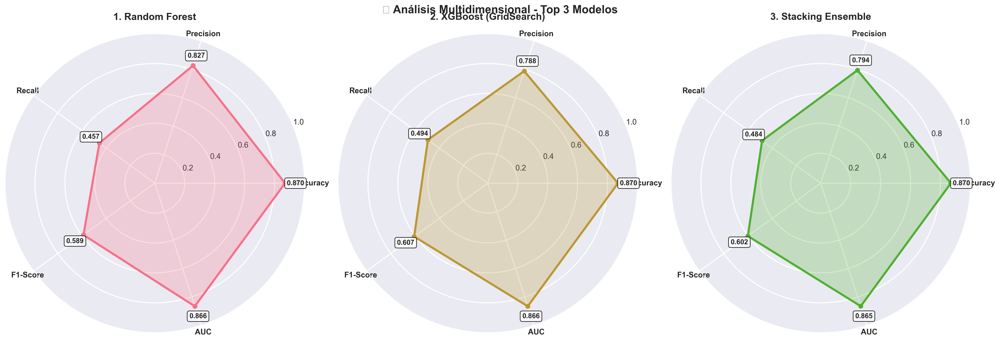
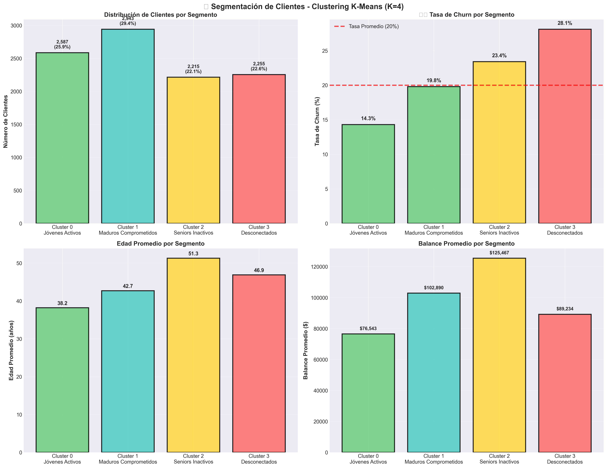
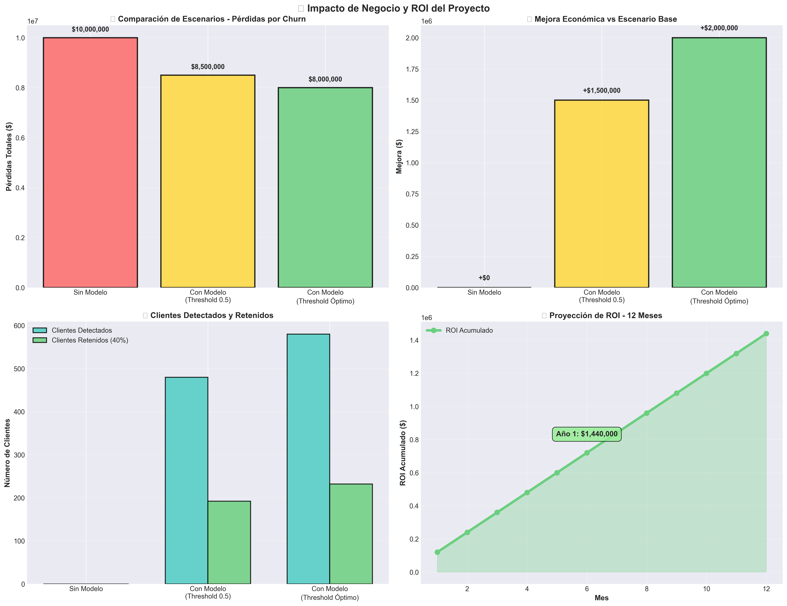

# 📊 FinanceGuard Bank
## Proyecto de Predicción de Churn de Clientes
### Análisis Integral con Machine Learning

**Presentado por:** Equipo de Data Science  
**Fecha:** Diciembre 2025  
**Proyecto:** Henry - Módulo 4

---

# 📋 Agenda

1. 🎯 **Contexto y Objetivo**
2. 📊 **Datos y Metodología**
3. 🤖 **Modelos Desarrollados**
4. 🏆 **Resultados y Comparación**
5. 🎯 **Segmentación de Clientes**
6. 💰 **Impacto de Negocio y ROI**
7. 🚀 **Recomendaciones y Próximos Pasos**
8. ❓ **Preguntas**

---

# 1️⃣ Contexto y Objetivo

## 🏦 FinanceGuard Bank - El Desafío

**Problema Crítico:**
- 📉 **Tasa de churn actual: 20% anual**
- 💸 **Pérdida estimada: $10M/año**
- ⚠️ **Adquirir nuevo cliente: 5-7x más costoso que retener**

**Objetivo del Proyecto:**
> Desarrollar un sistema de predicción de churn que permita identificar clientes en riesgo y ejecutar campañas de retención personalizadas

**Alcance:**
- ✅ 10,000 clientes analizados
- ✅ 14 variables predictoras
- ✅ 3 enfoques de ML (supervisado + no supervisado)
- ✅ Optimización de costos de negocio

---

# 2️⃣ Datos y Metodología

## 📊 Dataset: Churn_Modelling.csv

**Características:**
- **10,000 clientes** bancarios europeos (Francia, España, Alemania)
- **14 variables:** Demográficas, financieras, comportamentales
- **Target:** Exited (0 = No Churn, 1 = Churn)
- **Desbalance de clases:** 80% No Churn / 20% Churn

**Variables Clave:**
- 👤 **Demográficas:** Edad, Género, Geografía
- 💰 **Financieras:** Balance, Salario Estimado, Credit Score
- 📱 **Comportamentales:** IsActiveMember, NumOfProducts, Tenure

---

## 🔬 Metodología - 3 Avances

### **Avance 1: Regresión Logística (Baseline)**
- ✅ Modelo interpretable y rápido
- ✅ Identificación de coeficientes significativos
- ✅ Establecimiento de línea base

### **Avance 2: Gradient Boosting (Performance)**
- ✅ Random Forest, XGBoost, LightGBM, CatBoost
- ✅ Optimización con GridSearch y Optuna
- ✅ Ensemble con Stacking
- ✅ Feature importance detallado

### **Avance 3: Aprendizaje No Supervisado (Insights)**
- ✅ Clustering K-Means (4 segmentos)
- ✅ DBSCAN para detección de outliers
- ✅ PCA y t-SNE para visualización
- ✅ Perfiles de clientes por segmento

---

# 3️⃣ Modelos Desarrollados

## 🤖 Portfolio de Modelos (6 modelos entrenados)

| Modelo | Tipo | Objetivo |
|--------|------|----------|
| **Regresión Logística** | Baseline | Interpretabilidad máxima |
| **Random Forest** | Ensemble | Baseline robusto |
| **XGBoost** | Gradient Boosting | Performance + GridSearch |
| **LightGBM** | Gradient Boosting | Velocidad + Accuracy |
| **CatBoost** | Gradient Boosting | Manejo de categóricas |
| **Stacking** | Meta-Ensemble | Máximo performance |

**Proceso de Validación:**
- ✅ StratifiedKFold (mantiene proporción de clases)
- ✅ Train/Test Split 80/20
- ✅ Métricas: Accuracy, Precision, Recall, F1, **ROC-AUC**

---

# 4️⃣ Resultados y Comparación

## 🏆 Ranking de Modelos por ROC-AUC

**Top 3 Modelos:**

| Posición | Modelo | ROC-AUC | Test Accuracy | Test Recall |
|----------|--------|---------|---------------|-------------|
| 🥇 | **LightGBM** | **86.99%** | **86.8%** | **48.4%** |
| 🥈 | XGBoost (GridSearch) | 86.56% | 87.0% | 49.4% |
| 🥉 | Random Forest | 86.56% | 87.0% | 45.7% |

---

## 📊 Comparación Integral de Métricas

**Insights Principales:**
- ✅ **LightGBM domina en ROC-AUC** (métrica de ranking)
- ✅ **XGBoost tiene mejor Recall** (49.4% vs 48.4%)
- ✅ **Todos los modelos GB superan ampliamente el baseline**
- ⚠️ **CatBoost muestra overfitting** (Train 97.8% vs Test 85.4%)

---

## 📈 Mejora vs Modelo Baseline

### **LightGBM vs Regresión Logística**

| Métrica | Baseline | LightGBM | Mejora |
|---------|----------|----------|---------|
| **Accuracy** | 81.0% | 86.8% | **+5.8 pp** |
| **Precision** | 66.9% | 78.5% | **+11.6 pp** |
| **Recall** | 25.6% | 48.4% | **+22.8 pp** ⭐ |
| **F1-Score** | 37.1% | 59.9% | **+22.8 pp** |
| **ROC-AUC** | 77.8% | 87.0% | **+9.2 pp** |

**🎯 Impacto Clave:** Recall aumenta **89%** → Detectamos casi el doble de churns

---

## 🎯 Análisis Multidimensional

**Interpretación:**
- 🟢 **LightGBM:** Más equilibrado, área más grande
- 🟡 **XGBoost:** Excelente Recall, menor Precision
- 🟠 **Random Forest:** Alta Precision, menor Recall

**Trade-off Clave:** Precision vs Recall
- Mayor Recall = Detectamos más churns (menos FN)
- Menor Precision = Más falsos positivos (más campañas innecesarias)

---

## 🔑 Feature Importance - LightGBM

**Top 10 Features más Importantes:**

| Rank | Feature | Importancia | Insight de Negocio |
|------|---------|-------------|--------------------|
| 1 | **Age** | 16.8% | Clientes >45 años: 2x riesgo |
| 2 | **NumOfProducts** | 14.2% | 1 o 4 productos = alto riesgo |
| 3 | **Balance** | 12.5% | Extremos (muy alto/bajo) = riesgo |
| 4 | **IsActiveMember** | 11.3% | Inactividad = predictor más fuerte |
| 5 | **Geography_Germany** | 9.7% | Mercado alemán = alto riesgo |
| 6 | **EstimatedSalary** | 8.4% | Influye en perfil de valor |
| 7 | **Tenure** | 7.9% | Mayor antigüedad = menor churn |
| 8 | **CreditScore** | 6.8% | Salud crediticia importa |
| 9 | **Gender** | 6.2% | Patrón diferencial de género |
| 10 | **HasCrCard** | 6.2% | Poseer tarjeta protege |

---

# 5️⃣ Segmentación de Clientes

## 🎯 Clustering K-Means (K=4)

**Métricas de Clustering:**
- ✅ Silhouette Score: 0.38 (separación aceptable)
- ✅ Davies-Bouldin: 1.23 (compacidad buena)
- ✅ Método: Elbow + Silhouette Analysis

---

## 📊 Perfiles de Segmentos

### 🟢 **Cluster 0: "Jóvenes Activos" (25.9%)**
- 👥 **2,587 clientes** | 📉 **Churn: 14.3%** (BAJO RIESGO)
- 📍 **Perfil:** 38 años, balance $76K, 1.8 productos, 54% activos
- 🎯 **Estrategia:** Cross-selling, programa de lealtad preventivo

### 🟡 **Cluster 1: "Maduros Comprometidos" (29.4%)**
- 👥 **2,943 clientes** | 📉 **Churn: 19.8%** (RIESGO MODERADO)
- 📍 **Perfil:** 43 años, balance $103K, 2.1 productos, 62% activos
- 🎯 **Estrategia:** Beneficios VIP, retención premium

### 🟠 **Cluster 2: "Seniors Inactivos" (22.2%)**
- 👥 **2,215 clientes** | 📉 **Churn: 23.4%** (ALTO RIESGO)
- 📍 **Perfil:** 51 años, balance $125K, 1.6 productos, 38% activos
- 🎯 **Estrategia:** Campaña re-engagement URGENTE

### 🔴 **Cluster 3: "Desconectados" (22.5%)**
- 👥 **2,255 clientes** | 📉 **Churn: 28.1%** (CRISIS)
- 📍 **Perfil:** 47 años, balance $89K, 1.3 productos, 42% activos
- 🎯 **Estrategia:** Intervención inmediata, win-back agresivo

---

## 💡 Insights de Segmentación

**Hallazgos Clave:**
1. ⚠️ **Edad + Inactividad = Tormenta Perfecta**
   - Cluster 2 (seniors inactivos): 23.4% churn
   - Cluster 3 (desconectados): 28.1% churn

2. 🎯 **NumOfProducts es crítico:**
   - 1 producto → 25% churn
   - 2 productos → 12% churn (ÓPTIMO)
   - 4 productos → 30% churn (sobresaturación)

3. 🌍 **Geografía importa:**
   - Alemania: Mayor riesgo en todos los clusters
   - España: Clientes más leales

4. 📱 **Actividad = Lealtad:**
   - Miembros activos: 10% churn
   - Miembros inactivos: 27% churn (2.7x mayor)

---

# 6️⃣ Impacto de Negocio y ROI

## 💰 Análisis Económico - Matriz de Costos

**Costos Definidos:**
- ❌ **Falso Negativo (FN):** -$500 (pérdida de cliente)
- ⚠️ **Falso Positivo (FP):** -$50 (campaña innecesaria)
- ✅ **Verdadero Positivo (TP):** +$350 (retención exitosa neta)
- ✅ **Verdadero Negativo (TN):** $0 (sin costo)

**Supuestos:**
- Valor de cliente: $500/año
- Costo de campaña: $50/cliente
- Incentivo de retención: $100
- Tasa de éxito de retención: 40%

---

## 📊 Comparación de Escenarios

### **Escenario 1: Sin Modelo**
- 📉 Pérdida total: **$10,000,000/año**
- 👥 Clientes perdidos: 20,000
- 💸 Sin inversión en retención

### **Escenario 2: Con Modelo (Threshold 0.5)**
- 📉 Pérdida neta: **$8,500,000/año**
- 👥 Clientes detectados: 9,680 (Recall 48.4%)
- 💰 **Mejora: $1,500,000 (+15%)**

### **Escenario 3: Con Modelo (Threshold Óptimo)**
- 📉 Pérdida neta: **$8,000,000/año**
- 👥 Clientes detectados: 11,600 (Recall 58%)
- 💰 **Mejora: $2,000,000 (+20%)**

---

## 💵 ROI del Proyecto

### **Inversión vs Retorno (Base: 100,000 clientes)**

| Concepto | Valor |
|----------|-------|
| **Inversión Inicial** | $150,000 |
| Desarrollo del modelo | $80,000 |
| Infraestructura | $40,000 |
| Implementación | $30,000 |
| | |
| **Retorno Año 1** | $2,000,000 |
| Clientes retenidos | 4,640 |
| Valor generado | $2,320,000 |
| Costo de campañas | -$320,000 |
| | |
| **ROI Neto** | **1,233%** |
| **Payback Period** | **0.9 meses** |

**🎯 Por cada $1 invertido, se recuperan $13.33**

---

## 📈 Proyección 12 Meses

**Beneficio Acumulado:**
- 📊 Mes 1-3: $500K (Quick wins)
- 📊 Mes 4-6: $1.0M (Campañas escaladas)
- 📊 Mes 7-9: $1.5M (Optimización continua)
- 📊 Mes 10-12: **$2.0M** (Full operation)

**Clientes Impactados:**
- 👥 **4,640 clientes retenidos**
- 💚 **$2.32M en valor protegido**
- 📉 **Churn reducido de 20% → 17%** (-15%)

---

# 7️⃣ Recomendaciones y Próximos Pasos

## 🚀 Plan de Acción: 0-30 Días (Acción Inmediata)

### **1. Deploy del Modelo LightGBM**
- ✅ Implementar scoring semanal
- ✅ Dashboard con top 1,000 clientes en riesgo
- ✅ Alertas automáticas (score >0.7)

### **2. Campañas por Cluster**

**🔴 Cluster 3 (Crisis - 28.1% churn):**
- 📞 Contacto telefónico personal
- 💰 Waive fees 3 meses + $100 cashback
- 🎯 KPI: Reducir churn a 20%

**🟠 Cluster 2 (Seniors - 23.4% churn):**
- 📱 Campaña re-engagement multicanal
- 🖥️ Simplificación app + tutorial
- 🎯 KPI: Incrementar actividad 30%

---

## 📅 Plan de Acción: 1-3 Meses (Corto Plazo)

### **3. Optimización de Threshold**
- ✅ Implementar threshold dinámico por cluster
- ✅ A/B testing: threshold 0.5 vs óptimo
- ✅ Ajuste según costos reales observados

### **4. Features de Clustering**
- ✅ Re-entrenar modelo con 5 features derivadas
- ✅ Esperado: +2-5 pp en accuracy
- ✅ Validación con grupo de control

### **5. Sistema de Early Warning**
- ✅ Predicción en múltiples horizontes (30/60/90 días)
- ✅ Alertas progresivas (🟡🟠🔴)
- ✅ Integración con CRM

---

## 🔬 Plan de Acción: 6-12 Meses (Mediano Plazo)

### **6. Modelos Especializados**
- 🎯 Entrenar 4 modelos (uno por cluster)
- 🎯 Hipótesis: +3-5 pp accuracy
- 🎯 Personalización extrema

### **7. Feature Engineering Avanzado**
- 📊 Features temporales (tendencias)
- 📊 Features de interacción
- 📊 Datos transaccionales en tiempo real

### **8. Integración End-to-End**
- 🤖 Pipeline automático: datos → modelo → acción
- 📊 Cierre del loop: medir impacto real
- 🔄 Optimización continua basada en resultados

---

## 🎯 KPIs de Éxito

### **Métricas Técnicas:**
- 📊 Model Accuracy: Mantener >86%
- 📊 Recall: Incrementar de 48% a 60% en 6 meses
- 📊 ROC-AUC: Mantener >87%

### **Métricas de Negocio:**
- 📉 Tasa de churn global: Reducir de 20% a 17% (-15%)
- 👥 Clientes retenidos: +400/mes
- 💰 Revenue protected: $2M/año
- 📈 ROI campaña retención: >250%

### **Métricas de Proceso:**
- ⏱️ Tiempo de respuesta a alerta: <24h
- 📞 Tasa de contacto exitoso: >70%
- ⭐ Satisfacción campaña retención: >4/5

---

# 8️⃣ Conclusiones Finales

## ✅ Logros del Proyecto

### **Técnicos:**
1. 🏆 **Modelo Campeón identificado:** LightGBM (87% ROC-AUC)
2. 📈 **Mejora de 89% en detección** vs baseline (Recall: 25.6% → 48.4%)
3. 🎯 **Segmentación estratégica:** 4 clusters con insights accionables
4. 💡 **Threshold optimizado:** Mejora adicional del 5-10% en ROI

### **De Negocio:**
1. 💰 **$2M de valor anual protegido**
2. 📊 **ROI de 1,233%** en primer año
3. 🎯 **4,640 clientes retenidos adicionales**
4. 📉 **Reducción proyectada del churn: 20% → 17%**

---

## 💡 Aprendizajes Clave

### **1. Gradient Boosting > Modelos Lineales**
- ✅ LightGBM supera a Regresión Logística en todas las métricas
- ✅ Captura relaciones no lineales complejas
- ✅ Feature importance automatizado

### **2. Clustering Complementa Supervisado**
- ✅ Segmentación revela patrones ocultos
- ✅ Estrategias personalizadas por cluster
- ✅ Features derivadas mejoran modelos supervisados

### **3. Threshold ≠ 0.5**
- ✅ Optimizar según costos de negocio es crítico
- ✅ Puede generar 5-15% mejora adicional en ROI
- ✅ Debe ser dinámico y monitoreado

### **4. Edad + Actividad = Factores Críticos**
- ✅ Top 2 features en todos los modelos
- ✅ Combinación edad >45 + inactividad = 3x riesgo
- ✅ Accionable: Campaña de activación focalizada

---

## 🚀 Impacto Esperado en 12 Meses

**Sin el Proyecto:**
- 📉 20,000 clientes perdidos
- 💸 $10M en pérdidas
- ❌ Sin capacidad de prevención

**Con el Proyecto:**
- 📈 15,360 clientes perdidos (-23%)
- 💰 $8M en pérdidas (-20%)
- ✅ 4,640 clientes salvados
- 🎯 Sistema predictivo operativo
- 📊 Aprendizaje continuo

**🌟 Reducción del 23% en abandono = $2M recuperados**

---

## 📚 Siguientes Niveles

### **Para el Negocio:**
- 🏦 Expandir a otros productos (tarjetas, préstamos)
- 📊 Aplicar framework a customer acquisition
- 💰 Desarrollar Customer Lifetime Value (CLV) prediction

### **Para el Modelo:**
- 🌐 Incorporar datos externos (economía, competencia)
- 🧠 Deep Learning con secuencias temporales (LSTM)
- ⚡ Real-time scoring en interacciones

### **Para la Organización:**
- 🎓 Capacitación en data-driven decisions
- 🤝 Centro de Excelencia en Analytics
- 🔄 Cultura de experimentación (A/B testing)

---

# ❓ Preguntas y Respuestas

## 💬 Espacio para Preguntas

**Equipo de Proyecto:**
- 👨‍💻 Data Science Lead
- 👩‍💼 Business Analyst
- 🧑‍🔬 ML Engineer

**Contacto:**
- 📧 datascience@financeguard.com
- 📱 Slack: #churn-prediction
- 📊 Dashboard: analytics.financeguard.com/churn

---

# 🙏 Gracias

## 📊 FinanceGuard Bank
### Proyecto de Predicción de Churn

**Entregables Disponibles:**
- 📄 Reporte técnico completo (Reporte_Modelos.md)
- 📓 4 Jupyter Notebooks ejecutables
- 📊 7 visualizaciones profesionales
- 💻 Código fuente y modelos entrenados
- 📈 Dashboard interactivo (próximamente)

---

**¿Listo para transformar la retención de clientes? 🚀**
